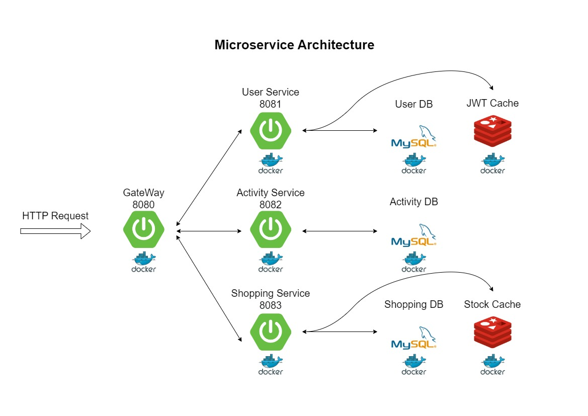
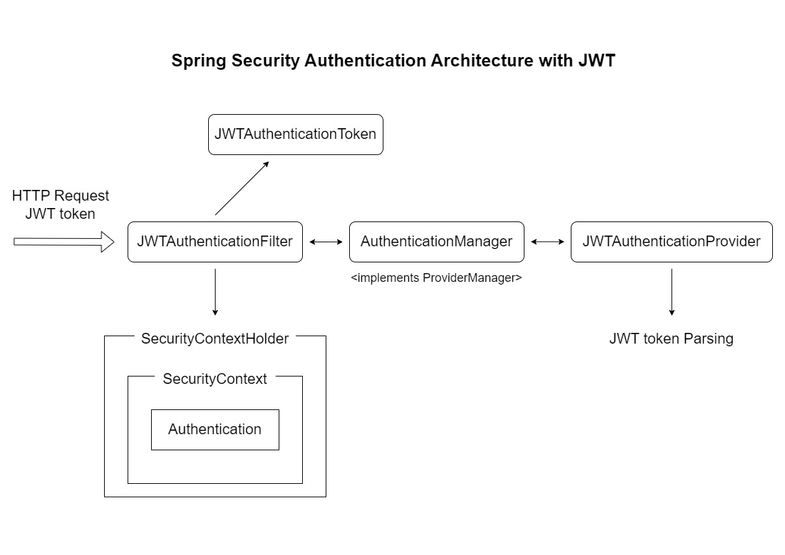

# Look at My Cat 🐈‍⬛
**Look at My Cat**은 나만의 고양이를 마음껏 자랑할 수 있는 웹 플랫폼입니다. 
이 프로젝트는 사용자들이 자신의 고양이 사진을 업로드하고 다른 사용자들과 소통할 수 있는 기능을 제공합니다.
댓글, 좋아요, 팔로우 기능을 활용하여 반려묘 커뮤니티를 형성할 수 있으며, 
사용자들은 특정 시간에 오픈되는 반려묘 관련 용품을 선착순으로 구매할 수 있습니다.

<br>

## API 명세서 및 주요 기능
API 명세서는 [이곳](https://documenter.getpostman.com/view/32558643/2sA35A8Qpk, "포스트맨 Documenter")에서 확인하세요. 
+ User Service
  + 회원가입, 로그인, JWT 인증/인가, AccessToken 재발급, 로그아웃, 회원정보 조회/수정
+ Activity Service
  + 팔로우/언팔로우, 뉴스피드, 포스트 CRUD, 댓글 CRUD, 포스트 및 댓글 좋아요
+ Shopping Service
  + 상품 조회, 장바구니 CRUD, 주문창 진입, 결제 및 결제 실패, 결제 내역 조회

<br>

## 개발 환경
+ Java 17
+ 프레임워크: SpringBoot (3.2.2)
+ 데이터베이스: MySQL
+ 캐싱 및 세션 관리: Redis
+ 컨테이너화: Docker
+ 통합 개발 환경: IntelliJ 2023.3.2

<br>

## 아키텍처
<details>
<summary>Microservice Architecture</summary>
<div>

</div>
</details>
<details>
<summary>Spring Security Authentication Architecture</summary>
<div>

</div>
</details>

<br>

## 프로젝트 설치
Docker 환경에서의 설치방법입니다.

```sh
git clone https://github.com/soyoung506/LookAtMyCat_Project.git
cd LookAtMyCat_Project
docker-compose up -d
```
   

